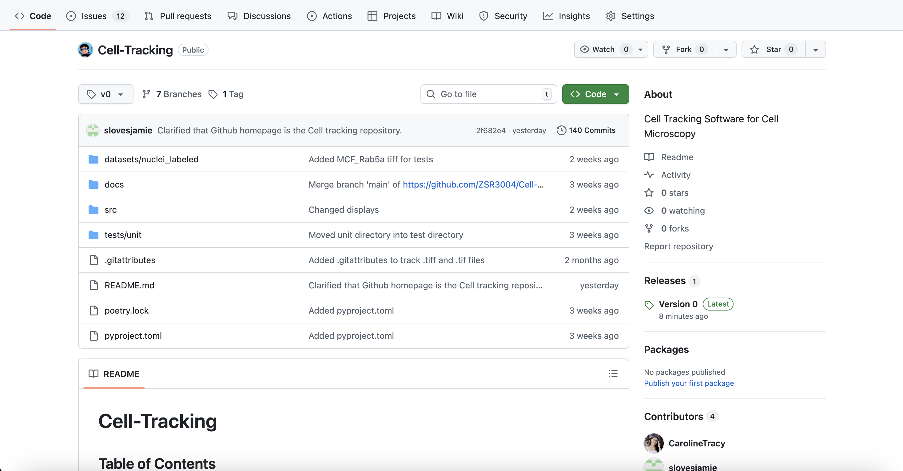

# User Guide (How to Upload Your Tiff Video for Desired Output)

**NOTICE:** This documentation is not yet complete. We haven't implemented the graphical user interface for cell-tracking yet and
only plan to do so once our command line interface is complete. While these instructions offer a general method to install the
graphical user interface, we do not actually have any releases available for it yet.

## Introduction

In this user guide, there are step by step instructions on how to upload your Tiff file to our software and receive the desired output (kymograph, heatmap, vector field, sparse-like optical flow visualization, and raw data [xyz file, arrays]). This user guide is intended for the Mitchel lab and its members, as well as any other lab that would like to utilize this software. We will describe how to download our app, upload the video, choose the desired outputs, and save the results on your device/email the output to others.
<br><br>
## Equipment and Supplies

1. Computer with storage space available
2. Completed Tiff video
3. Internet access

You will also need.
1. Python 3 is installed 
2. A Command Line Interface, such as: 
    * Terminal (Mac)
    * Command Prompt or Powershell (Windows)
    * Integrated Terminal in VS Code
<br><br>
## How To Use Our Software

This next section will go over the sub-tasks that the user can follow to run our software.

### 1. Download and Run the App
NOTE: These are the same instructions as the CLI. 

1. Open Google Chrome or a supporting internet browser.

2. Follow this [link](https://github.com/ZSR3004/Cell-Tracking/tree/main)
    - Note: After step 2, you should have arrived at the GitHub homepage, titled "Cell Tracking." (this page will contain all of the files you need to download.) You will see a screen like the image below,  which displays the GitHub homepage.

3. Clone the Github repository using your terminal. Just open up the terminal and type
```bash
git clone https://github.com/ZSR3004/Cell-Tracking
```

4. `cd` into the repository.
```bash
cd Cell-Tracking
```

5. Once inside the directory, you need to setup the dependencies. Just type the following into the command line.
```bash
python3.13 -m venv .venv
source .venv/bin/activate # or the equivalent for your device
pip install poetry
poetry install
```

6. Now, you can run the tool in two ways. You can use Python directly: 
```bash
.venv/bin/python3.13 frontend/flask/app.py
```

Or you can use the provided script to launch the CLI. 
```bash
chmod +x ctwb // Tell your computer this is safe to execute.
./ctwb
```
If you 
plan to use the CLI frequently, you may wish to use the bash
script and add it to you PATH.

7. You should see an output that looks something like this.
```bash
 * Serving Flask app 'app'
 * Debug mode: off
WARNING: This is a development server. Do not use it in a production deployment. Use a production WSGI server instead.
 * Running on http://127.0.0.1:5000
Press CTRL+C to quit
```

Just click on that link or type it into your preferred web-browser, and the webapp should show up.

### 2. Upload video to our software

1. Open the downloaded application.

2. On the main page, select "Upload Tiff Video." You'll now see a new window with a button saying "Upload file". You have two options to upload files.

  - Click the "Upload file" button. This will open your Finder or File Explorer. You can navigate to wherever your TIFF file is located, double-click it, and then press "Open" in the bottom right corner of this window. You should see a progress bar and the uploading will have begun.
  - If you already have the file open (say on your desktop or in Finder/File Explorer), you can select the file and drag it into this window. You will see a progress bar and uploading will have begun.

    - Note: If the file you attempt to upload is not a TIFF file (specficailly, a file with extension .tiff, .tif, .tiff.ome, or .tif.ome), then the program will tell you this is an invalid file type.

3. Once the upload is complete, you will see a screen like figure [FIGUREX] with the file name in the middle of the page. Confirm this file name matches the file you intended to upload and click "Next". If you accidentally uploaded the wrong file, click the "Remove" button on the same screen and try step 3 again.


### 3. Select desired output
Now, you will need to tell Cell Tracker what type of video you have uploaded into the system. Namely, if it's a nuclei or cytoplasm labeled file. You will also tell the program what information or visualizations you would like the program to output. The current program output types are as follows:
  - Heatmaps
  - Kymographs
  - An array representing the optical flow
  - An XYZ file representing the optical flow

1. Select the dropdown menu. 

    - Note: A dropdown menu, as shown in figure [FIGUREX] should pop up, with a list of outputs.

2. Select the outputs you want by clicking the checkbox next to each one.

3. Click the "Next" button from the same page.

    - Note: A new screen, as shown in figure [FIGUREX], will pop up listing the outputs you want to receive. Check and make sure that everything you want is there.

4. From the same screen, click "Get results".


### 4. Access the output from your computer

Our software has two different ways that the user can utilize to access the output: Save the output to your computer or through an email. First we will list the steps to download the output to your computer, then we will go over how to receive the output through an email. Note: At this point, ensure that the desired output is ready to be saved to your computer.

- Saving the output on your computer:

  1. Once you are satisfied with the output, click on the "Save" button. 

  2. A file explorer window will open, as seen on figure [FIGUREX]. Navigate to the folder where you would like to save the result.

  3. Enter a descriptive name for your output file. 

  4. Like previously, from the explorer window, choose the file format that you like to save the video in. 

  5. After naming and selecting the file format, click "Save" to finalize the process to save the output to your computer. 

- Receiving an email of the output:

  1. Once you have clicked the "save" button, click the "Email Output" button.

  2. On the email space, as seen on figure [FIGUREX], enter the email addresses of the recepients and add a message (if desired).

  3. Click "Send".
<br><br>
